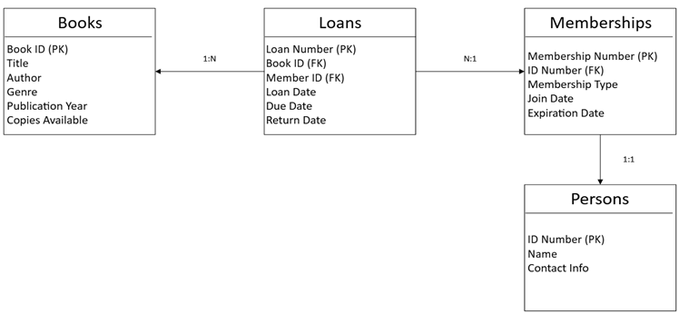
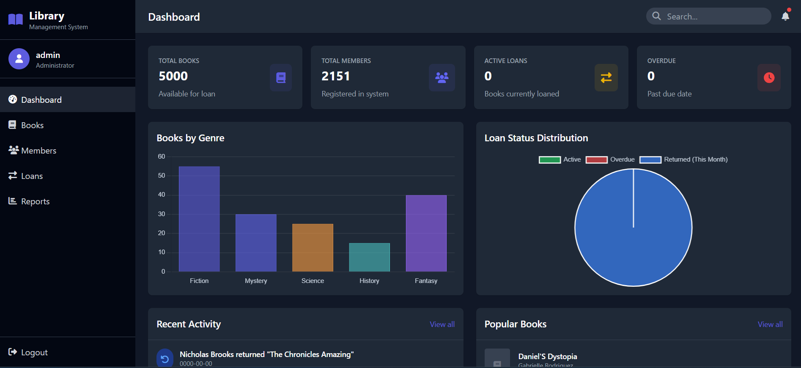

# Library Management System

## Overview
The Library Management System (LMS) is a comprehensive solution designed to manage library operations, including book cataloging, member management, and loan processing. This project was developed as part of a school project and is structured to facilitate easy collaboration and deployment.

## Features
- Synthetic data generation for testing and development.
- BCNF normalization of the database schema.
- Web application built with Flask for user-friendly library management.
- Secure user authentication and session management.
- Interactive dashboard for real-time library statistics.

## Data Generation Usage
To generate synthetic data for the library system:

1. **Generate CSV Files**:
   ```bash
   python data-generation/csv_generator.py
   ```
   This will create three CSV files in the `CSV_files/` directory:
   - `books.csv` - Books catalog data
   - `members.csv` - Member information
   - `loans.csv` - Loan transaction records

2. **Customizing Data Generation**:
   - To modify book title generation patterns, edit `book_title_generator.py`
   - Adjust generation parameters by modifying the constants at the top of `csv_generator.py`:
     - `NUM_BOOKS` (default: 5000)
     - `NUM_MEMBERS` (default: 1500)
     - `START_DATE` (default: January 2020)


## Database Usage
To set up and work with the database:

1. **Creating the Database**:
   - Import the SQL files from `database/schema/create_database/` into your MySQL server

2. **Loading Data**:
   - Use your database client to import the CSV files from the `CSV_files/` directory
   - Ensure you're importing into the correct tables as defined in the schema

3. **Normalizing the Database**:
   - After importing data and creating the database, run the scripts from `database/schema/normalization/` to convert the schema to BCNF
   - These scripts will create new normalized tables and migrate data appropriately
        

4. **Running Queries**:
   - For common read operations, use the scripts in `database/queries/selects/`
   - For data modifications, use scripts in `database/queries/modifications/`
   - To create useful database views, run the scripts in `database/queries/views/`

## Web Application Usage
To run the web application:

1. **Start the application**:
   ```bash
   python web-application/app.py
   ```

2. **Access the interface**:
   - Open your web browser and navigate to `http://127.0.0.1:5000`
   - Default login credentials: 
     - Username: admin
     - Password: admin

3. **Available Features**:
   - Dashboard: View library statistics and current status
      
   - Books: Search, add, and manage the book catalog
   - Members: Manage library memberships and user information
   - Loans: Process borrowing, returns, and check due dates
   - Reports: Generate usage and inventory reports

4. **Admin Functions**:
   - Access the admin panel at `/admin` for system configuration
   - Manage staff accounts and permissions
   - Perform database maintenance operations

## Installation
1. Clone the repository:
   ```
   git clone https://github.com/HasanZiyade/library-management-system.git
   ```
2. Navigate to the project directory:
   ```
   cd library-management-system
   ```
3. Install the required packages:
   ```
   pip install -r requirements.txt
   ```
4. Configure database connection:
   - Edit the appropriate configuration file in the web application directory with your database credentials

## Contributing
Contributions are welcome! Please open an issue or submit a pull request for any improvements or bug fixes.

## License
This project is licensed under the MIT License. See the LICENSE file for more details.
